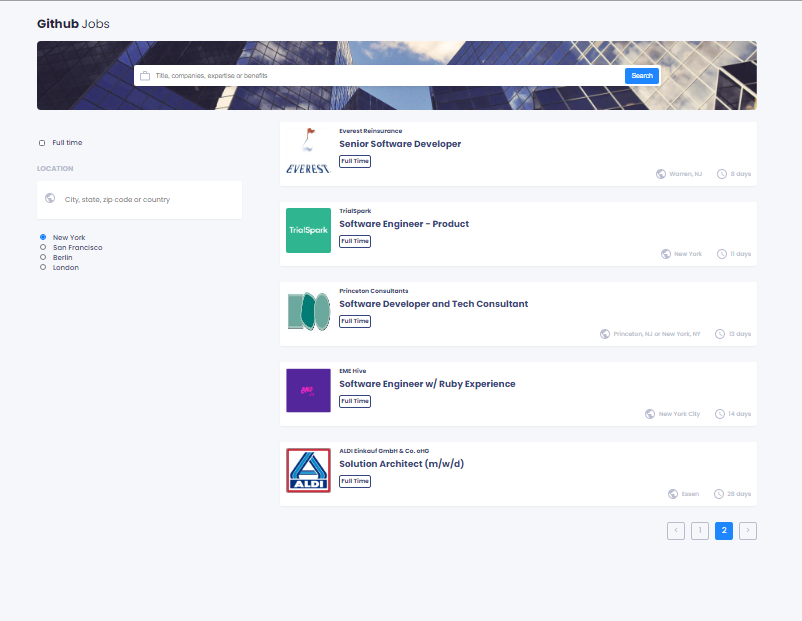
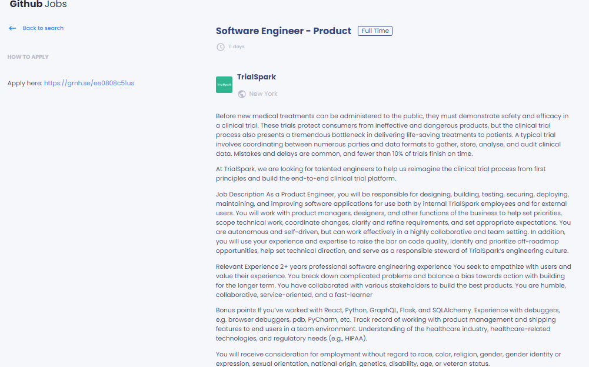

# Github Jobs

Refactor github jobs project with styled and compound components.

## What I need to build is: 

- Create a page that shows all the job lists from the given api below.
- Allow users to search for a job by its title or location.
- When each item is clicked, show the job details by going to another page.
- Make the pagination works, in each page there should be five items. When click each page it should go to the page which is clicked. It only shows the number of page which is enough for the list.

## Structure

In this project, I use compound components and styled components for styling.

 - I stored all the components inside of a folder called components. 
 - All the page is stored in the page folder.
 - Also, store all the components in the index file so that it is easy to call.
 - I use `useReducer` for the state that I need to change all the time.
 - But also, I use basic context to store all the functionalities.
 

 
 

**Icon**: https://google.github.io/material-design-icons/ (you can also use the react-icons package)

**API**: https://jobs.github.com/api. Use data from the API to create questions and answers.

I use this link to prevent from getting some CORS errors https://cors-anywhere.herokuapp.com/ to help with accessing data from other websites that are normally forbidden by the same-origin policy of web browsers

**Design** : https://www.figma.com/file/gAkVx9CdOqnJcCjJ7nVNkw

<h1 align="center">Github Jobs</h1>

<div align="center">
  <h3>
    <a href="https://github-jobs-refactor-noeline.netlify.app/">
      Demo
    </a>
    <span> | </span>
    <a href="https://github.com/vakodrazan/github-jobs-refactor">
      Solution
    </a>
  </h3>
</div>

## Built with: 

    - [React](https://reactjs.org/)
    - [Parcel](https://parceljs.org/)
    - [Date fns](https://date-fns.org/)


## How To Use

<!-- Example: -->

To clone and run this application, you'll need [Git](https://git-scm.com) and [Node.js](https://nodejs.org/en/download/) (which comes with [npm](http://npmjs.com)) installed on your computer. From your command line:

```bash
# Clone this repository
$ git clone https://github.com/your-user-name/your-project-name

# Install dependencies
$ npm install

# Run the app
$ npm start
```